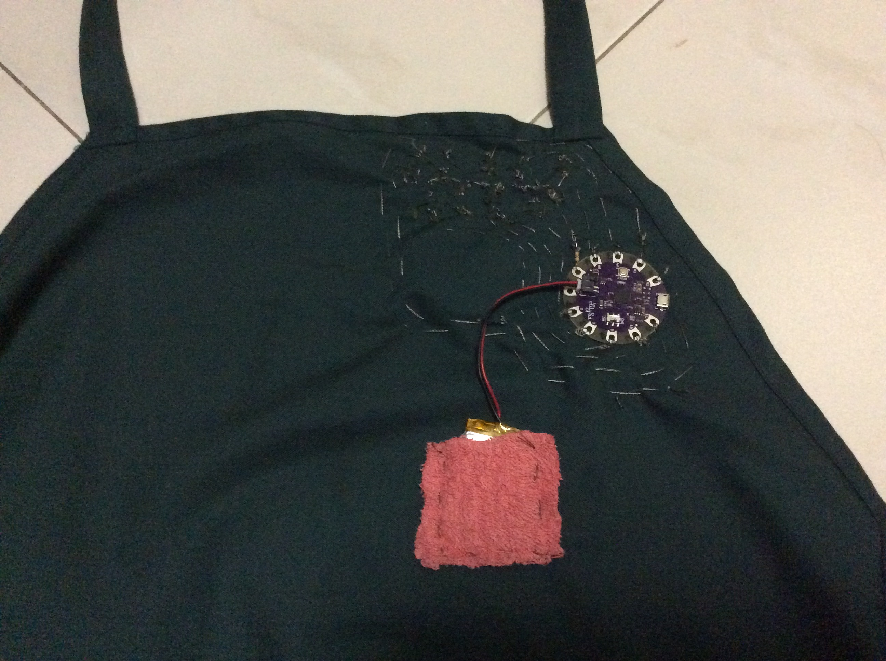

# name-blinker
A name blinker wearable tech I made for my Repair Kopitiam apron.

##Demo video on Youtube

##Pictures

Front

Back

##Parts used
1. LilyPad Arduino USB (ATmega32u4 with integrated Lipo charger)
2. 9x Adafruit LED Sequins
3. 470ohm resistor connected to ground
4. Adafruit 2 ply Stainless Thin Conductive Thread
5. 1000mAh Lithium-ion battery

##Libraries used
1. [LowPower by RocketScream](https://github.com/rocketscream/Low-Power)
2. [3D-Printed letters](http://www.thingiverse.com/thing:15198)
